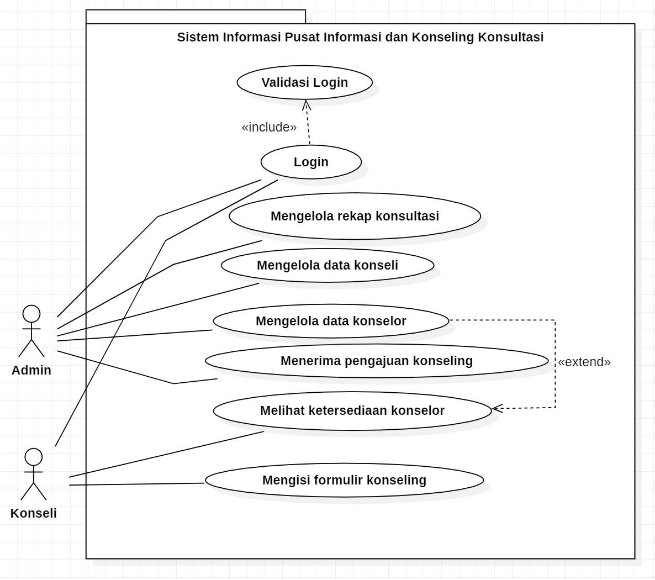
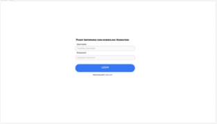
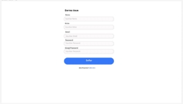
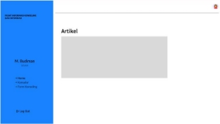
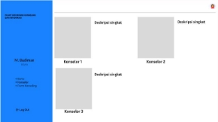
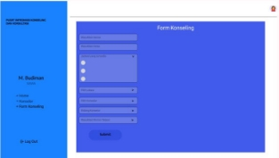
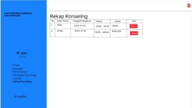
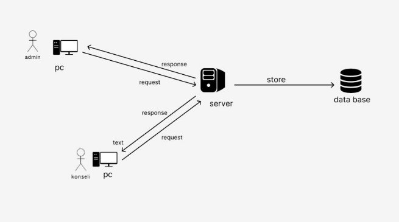
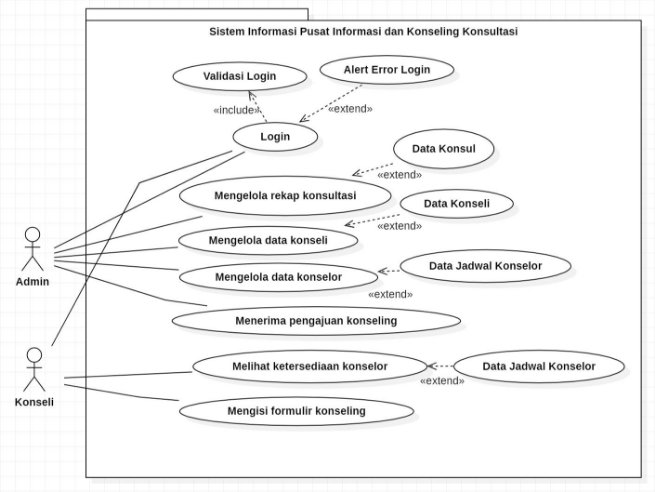
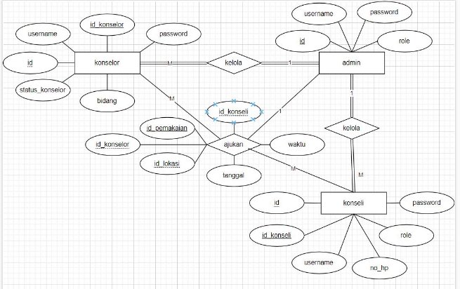

**Software Requirements**

**Specification**

**for**

**Pusat Informasi dan Konseling Konsultasi**

**Prepared by Abdul Habib Risyik (2257301001) Muhammad Amien Rais (2257301084) Muhammad Farel Wicaksono (2257301089)**

**Muhammad Rizki (2257301094)**

**01st November 2023**

**Bab I Pendahuluan**

1. **Tujuan**

Pusat informasi dan konseling Konsultasi (PIK K) adalah wadah kegiatan program untuk siswa bisa berkonsultasi dengan Guru BK di SMA IT Al - Ittihad. Tujuan dari program ini dibangun adalah untuk memudahkan penentuan waktu dan lokasi sehingga memudahkan bagi para guru siswa dalam mengatur penjadwalan konsultasi. Sehingga ini bisa menjadi acuan untuk membangun perangkat lunak “PUSAT INFORMASI DAN KONSELING KONSULTASI”.

2. **Lingkup**

Pusat Informasi dan Konseling Konsultasi (PIK K) merupakan web yang kami bangun di SMA IT Al - Ittihad untuk mempermudah penentuan waktu dan lokasi sehingga memudahkan bagi para guru siswa dalam mengatur penjadwalan konsultasi.

3. **Akronim, singkatan, definisi**

|**Istilah**|**Definisi**|
| - | - |
|SRS|Software Requirement Specification|
|Login|Digunakan untuk mengakses aplikasi|
|Software Requirement Specification|Perangkat lunak yang akan dibuat dan sebagai menjembatani komunikasi pembuat dengan pengguna|
|Use Case|Situasi dimana sistem anda digunakan untuk memenuhi satu atau lebih kebutuhan pemakaian anda|

4. **Referensi**

Referensi yang digunakan dalam pengembangan perangkat lunak ini adalah :

5. **Overview**

Bab selanjutnya yaitu menjelaskan sistem yang diterapkan pada aplikasi. Menjelaskan gambaran umum dari aplikasi, sistem interface aplikasi dan alur sistemnya. Bab terakhir menjelaskan tentang setiap fungsi yang digunakan secara teknisnya. Pada bab 2 dan 3 merupakan deskripsi dari aplikasi yang akan diterapkan pada aplikasi yang dibuat.

**BAB II Gambaran Umum**

Pada zaman era globalisasi perkembangan teknologi begitu sangat pesat, salah satunya ialah perkembangan teknologi di bidang software engineering dimana software engineering dapat digunakan dalam kehidupan sehari - hari .dalam studi kasus Proyek kali ini kami mewawancarai salah satu sekolah yang ada di pekanbaru yaitu SMA IT Al - Ittihad. Kasus yang kami peroleh

bernama Pusat Informasi dan Konseling Konsultasi. Maka dari itu kami sebagai software engineering merancang sebuah sistem sesuai dengan kebutuhan SMA IT Al - Ittihad, software yang kami buat ini berbasis website, pada sistem ini para siswa dapat menentukan siapa yang akan menjadi konselor mereka dan dapat menentukan waktu dan lokasi yang diinginkan.

1. **Perspektif Produk**

Pusat informasi dan konseling Konsultasi SMA Al - Ittihad adalah sebuah sistem penjadwalan konseling yang diaplikasikan pada website. Terdapat 2 jenis yaitu admin dan konseli. Pengolahan data di kelola oleh admin pada website dan konseli melihat ketersediaan konselor, lokasi, jadwal dan dapat mendaftar sebagai konseli.

1. **Antarmuka Sistem**

2. **Antarmuka Pengguna**
- Mockup Admin ( Website )

|||
| - | - |
|Pada halaman login diminta untuk mengisi username dan password.|Pada halaman daftar ini user akan membuat akun dengan inputkan nama, kelas, email dan password.|
|||
|Pada halaman home user akan langsung melihat artikel-artikel yang ada di halaman home dan dapat melihat berbagai menu di sebelah kiri.|Pada halaman Konselor user bisa melihat profil-profil, bidang dan ketersediaan dari konselor-konselor yang ada.|
|||
|Pada halaman Form Konsul user nanti nya akan mengisi form yang tersedia untuk mengajukan konsultasi.|Pada halaman Home Admin, Admin bisa menambah dan menghapus artikel.|
|||
|Pada halaman Konselor di Admin, Admin dapat menambah dan mengedit data-data dari konselor.|Pada halaman Form Konsul di Admin, Admin bisa menambah dan mengedit isi form konsul.|
|||
|Pada halaman pengajuan konseling ini admin bisa terima atau tolak pengajuan, jika terima maka akan langsung masuk ke Rekap Konseling jika ditolak tidak masuk Rekap Konseling.|Pada halaman Konseli Admin dapat melihat data konseli yang mengajukan konseling.|
|||
|Pada halaman Rekap konseling ini Admin dapat menghapus data rekapan.||
3. **Antarmuka Perangkat Keras**

Antarmuka perangkat keras yang digunakan untuk mengoperasikan Perangkat Lunak Pusat Informasi dan Konseling Konsultasi antara lain :

1\. PC / Laptop untuk menjalankan web ini admin membutuhkan sebuah PC yang menggunakan OS WIndows, Linux, atau MAC dan sudah terinstall browser.

4. **Antarmuka Perangkat Lunak** Tidak ada
4. **Antarmuka Komunikasi**

Antarmuka komunikasi yang digunakan untuk mengoperasikan Perangkat Lunak Pusat Informasi dan Konseling Konsultasi antara lain :

1. Kabel Lan UTP RJ45
1. Modem
1. Wifi
6. **Batasan Memori** Tidak ada
6. **Operasi - Operasi**

|Operasi|Fungsi|
| - | - |
|Login|Digunakan untuk mengakses aplikasi|
|Input Data|Digunakan untuk memasukkan data-data|
|Kembali|Digunakan untuk kembali ke halaman sebelumnya|

|Hapus|Digunakan untuk menghapus data|
| - | - |
|Edit|Digunakan untuk mengubah data|
|View|Digunakan untuk menampilkan data|
|Simpan|Digunakan untuk menyimpan data|
|Cetak|Digunakan untuk mencetak laporan|

8. **Kebutuhan Adaptasi** Tidak ada
2. **Spesifikasi Kebutuhan Fungsional**

1. **Konseli Login** Use Case : Login Diagram :

Deskripsi Singkat Konseli melakukan login terlebih dahulu sebelum masuk ke tampilan home, apabila tidak dapat mengakses atau gagal konseli dapat meminta kepada admin dibuatkan akunnya. Deskripsi langkah - langkah :

1. Konseli melakukan login dengan memasukkan username dan password
1. Sistem melakukan validasi login
1. Bila sukses sistem akan mengarahkan ke halaman utama
1. Bila gagal sistem akan menampilkan pesan kesalahan dan menampilkan halaman login kembali

Xref : Bagian 3.2.1, Konseli Login

2. **Konseli Melihat Ketersediaan Konselor**

Use Case : Melihat Ketersediaan Konselor Diagram :

Deskripsi Singkat Konseli dapat melihat ketersediaan konselor pada menu konselor. Deskripsi langkah - langkah :

1. Konseli mengklik menu konselor
1. Sistem akan menampilkan daftar konselor, nama, bidang beserta jadwal konselor

Xref : Bagian 3.2.2, Konseli Melihat Ketersedian Konselor

3. **Konseli Mengisi Formulir Konseling** Use Case : Mengisi Formulir Konseling Diagram :

Deskripsi Singkat Konseli dapat mengisi formulir konseling.

Deskripsi langkah - langkah :

1. Konseli mengklik menu form pengajuan
1. Sistem akan menampilkan halaman form pengajuan
1. Konseli mengisi form pengajuan
1. Konseli akan dihubungi oleh admin jika pengajuan konsultasi diterima

Xref : Bagian 3.2.3, Konseli Mengisi Formulir Konseling

4. **Admin Login** Use Case : Login Diagram :

Deskripsi Singkat Admin melakukan login terlebih dahulu sebelum masuk ke tampilan home dengan memasukkan username dan password, apabila login gagal maka sistem akan menampilkan pesan kesalahan / error.

Deskripsi langkah - langkah :

1. Admin melakukan login dengan memasukkan username dan password
1. Sistem melakukan validasi login
1. Bila sukses sistem akan mengarahkan ke halaman utama
1. Bila gagal sistem akan menampilkan pesan kesalahan dan menampilkan halaman login kembali

Xref : Bagian 3.2.4, Admin Login

5. **Admin Mengelola Rekap Konsultasi** Use case : Mengelola Rekap Konsultasi

Diagram :

Deskripsi Singkat Admin mengelola rekap konsultasi di dalam nya admin dapat menghapus rekap konsultasi.

Deskripsi langkah - langkah :

1. Admin mengklik menu rekap konsultasi
1. Sistem akan menampilkan halaman menu rekap konsultasi

Xref : Bagian 3.2.5, Admin Mengelola Data Konseli

6. **Admin Mengelola Data Konseli** Use Case : Mengelola Data Konseli Diagram :

Deskripsi Singkat Admin mengelola data konseli didalam nya admin dapat menghapus, mengedit data konseli

Deskripsi langkah-langkah:

1. Admin mengklik menu konseli
1. Sistem akan menampilkan halaman menu konseli

Xref : Bagian 3.2.6, Admin Mengelola Data Konseli

7. **Admin Mengelola Data Konselor** Use Case : Mengelola Data Konselor Diagram :

Deskripsi Singkat Admin mengelola data konselor, admin dapat menambahkan, menghapus, mengedit data konselor

Deskripsi langkah-langkah:

1. Admin mengklik menu konselor
1. Sistem akan menampilkan halaman menu konselor

Xref : Bagian 3.2.7, Admin Mengelola Data Konselor

8. **Admin Menerima Pengajuan Konseling**

Use Case : Mengkonfirmasi Pemakaian Konseling Diagram :

Deskripsi Singkat Admin mengelola data pengajuan, admin dapat menambahkan, menghapus, mengedit data pengajuan

Deskripsi langkah-langkah:

1. Admin mengklik menu konsultasi
1. Sistem akan menampilkan halaman menu konsultasi

Xref : Bagian 3.2.8, Admin Menerima Pengajuan Konseling

3. **Spesifikasi Kebutuhan Non-Fungsional**
- Tabel Kebutuhan Non-Fungsional

|No|Deskripsi|
| - | - |
|1|Semua interface dan fungsi menggunakan Bahasa Indonesia|
|2|Perangkat Lunak dapat dipakai di semua platform OS ( Admin dan Konseli )|

4. **Karakteristik Pengguna**

Karakteristik pengguna dari perangkat lunak ini adalah pengguna langsung berinteraksi dengan sistem tanpa harus dihubungkan dengan hak akses atau level autentikasi.

5. **Batasan - Batasan**
- Perangkat lunak web hanta dijalalnkan di windows (7,8,10).
- Waktu pengembangan perangkat lunak yang singkat membuat adanya kemungkinan tidak semua fungsi yang ada dapat dilaksanakan.
6. **Asumsi - Asumsi**

Tidak ada

7. **Kebutuhan Penyeimbang**

Tidak ada

**BAB III Requirement Specification**

1. **Persyaratan Antarmuka Eksternal**

Salah satu cara mengakses aplikasi ini yaitu dengan membuat akun terlebih dahulu untuk yang belum mempunyai akun, login melalui aplikasi ini dengan mencantumkan username dan password kemudian sistem akan memvalidasi login. Setelah login berhasil sistem akan menampilkan halaman utama.

2. **Functional Requirement**

Logika Struktur terdapat pada bagian 3.3.1

1. **Konseli Login**

|Nama Fungsi|Login|
| - | - |
|Xref|Bagian 2.2.1 Konseli Login|
|Trigger|Membuka web Pusat Informasi Konseling dan Konsultasi|
|Precondition|Halaman login|
|Basic Path|
1. Konseli melakukan login dengan memasukkan username dan password

2. Sistem melakukan validasi login

3. Bila sukses sistem akan mengarahkan ke halaman utama

4. Bila gagal sistem akan menampilkan pesan kesalahan dan menampilkan halaman login kembali
|
|Alternatif|Tidak ada|
|Post Condition|Konseli dapat login dan mengakses website Pusat Informasi Konseling dan Konsultasi|
|Exception Push|Username dan password salah|

2. **Konseli Melihat Ketersediaan Konselor**

|Nama Fungsi|Melihat ketersediaan konselor|
| - | - |
|Xref|Bagian 2.2.2 Konseli Melihat Ketersediaan Konselor|
|Trigger|Konseli menekan menu konselor|
|Precondition|Halaman Utama Konseli|
|Basic Path|
1. Konseli mengklik menu konselor

2. Sistem akan menampilkan daftar konselor, nama, bidang beserta jadwal konselor
|
|Alternatif|Tidak ada|
|Post Condition|Halaman menu konselor|
|Exception Push|Tidak ada|

3. **Konseli Mengisi Formulir Konseling**

|Nama Fungsi|Mengisi formulir Konseling|
| - | - |
|Xref|Bagian 2.2.3 Konseli Mengisi Formulir Konseling|
|Trigger|Konseli menekan menu Form Konseling|
|Precondition|Halaman Utama Konseli|
|Basic Path|
1. Konseli mengklik menu form pengajuan

2. Sistem akan menampilkan halaman form pengajuan

3. Konseli mengisi form pengajuan
|
|Alternatif|Tidak ada|
|Post Condition|Konseli dapat melakukan konseling sesuai jadwal dan lokasi yang sudah disepakati|
|Exception Push|Tidak ada|

4. **Admin Login**

|Nama Fungsi|Login|
| - | - |
|Xref|Bagian 2.2.4 Admin Login|
|Trigger|Membuka web Pusat Informasi Konseling dan Konsultasi|
|Precondition|Halaman login|
|Basic Path|
1. Admin melakukan login dengan memasukkan username dan password

2. Sistem melakukan validasi login

3. Bila sukses sistem akan mengarahkan ke halaman utama

4. Bila gagal sistem akan menampilkan pesan kesalahan dan menampilkan halaman login kembali
|
|Alternatif|Tidak ada|
|Post Condition|Admin dapat login dan mengakses website Pusat Informasi Konseling dan Konsultasi|
|Exception Push|Username dan password salah|

5. **Admin Mengelola Rekap Konsultasi**

|Nama Fungsi|Mengelola rekap konsultasi|
| - | - |
|Xref|Bagian 2.2.5 Admin Mengelola Rekap Konsultasi|
|Trigger|Admin menekan menu Rekap Konsultasi|
|Precondition|Halaman Utama Admin|
|Basic Path|
1. Admin mengklik menu rekap konsultasi

2. Sistem akan menampilkan halaman menu rekap konsultasi
|
|Alternatif|Tidak ada|
|Post Condition|Halaman Rekap Konsultasi|
|Exception Push|Tidak ada|

6. **Admin Mengelola Data Konseli**

|Nama Fungsi|Mengelola Data Konseli|
| - | - |
|Xref|Bagian 2.2.6 Admin Mengelola Data Konseli|
|Trigger|Admin menekan menu Konseli|
|Precondition|Halaman Utama Admin|
|Basic Path|
1. Admin mengklik menu konseli

2. Sistem akan menampilkan halaman menu konseli
|
|Alternatif|Tidak ada|
|Post Condition|Halaman Konseli|
|Exception Push|Tidak ada|

7. **Admin Mengelola Data Konselor**

|Nama Fungsi|Mengelola data konselor|
| - | - |
|Xref|Bagian 2.2.7 Admin Mengelola Data Konselor|
|Trigger|Admin menekan menu Konselor|
|Precondition|Halaman Utama Admin|
|Basic Path|
1. Admin mengklik menu konselor

2. Sistem akan menampilkan halaman menu konselor
|
|Alternatif|Tidak ada|
|Post Condition|Halaman Konselor|
|Exception Push|Tidak ada|

8. **Admin Menerima Pengajuan Konseling**

|Nama Fungsi|Mengkonfirmasi pemakaian konseling|
| - | - |
|Xref|Bagian 2.2.8 Admin Mengkonfirmasi Pemakai Konseling|
|Trigger|Admin menekan menu Pengajuan Konseling|
|Precondition|Halaman Utama Admin|
|Basic Path|
1. Admin mengklik menu konsultasi

2. Sistem akan menampilkan halaman menu konsultasi
|
|Alternatif|Tidak ada|
|Post Condition|Halaman Pengajuan Koseling|
|Exception Push|Tidak ada|

3. **Struktur Detail Kebutuhan Non-Fungsional**

**3.3.1 Logika Struktur Data**

**Tabel Admin**

|Data Item|Type|Deskripsi|
| - | - | - |
|id|char|Nomor auto increment id\_admin|
|username|varchar|Berisikan username untuk akses login|
|password|varchar|Berisikan password untuk login|
|role|varchar||
**Tabel Konseli**

|Data Item|Type|Deskripsi|
| - | - | - |
|id\_konseli|char|Nomor auto increment id\_konseli|
|username|varchar|Berisikan username untuk akses login|
|password|varchar|Berisikan password untuk login|
|no\_hp|varchar|Berisikan no hp konseli|
|role|||
**Tabel Konselor**

<table><tr><th colspan="1">Data Item</th><th colspan="1">Type</th><th colspan="1">Deskripsi</th></tr>
<tr><td colspan="1">username</td><td colspan="1">varchar</td><td colspan="1">Berisikan username untuk akses login</td></tr>
<tr><td colspan="1">id</td><td colspan="1">char</td><td colspan="1">Nomor auto increment id_konselor</td></tr>
<tr><td colspan="1">password</td><td colspan="1">varchar</td><td colspan="1">Berisikan password untuk login</td></tr>
<tr><td colspan="1" valign="bottom">Id konselor</td><td colspan="1" rowspan="2">char</td><td colspan="1" rowspan="2">Nomor auto increment id_konselor</td></tr>
<tr><td colspan="1"></td></tr>
<tr><td colspan="1">status_konselor</td><td colspan="1">varchar</td><td colspan="1">Berisikan status konselor</td></tr>
<tr><td colspan="1" valign="top">bidang</td><td colspan="1" valign="top">varchar</td><td colspan="1">Berisikan bidang untuk konsultasi yang ingin lebih berfokus pada suatu bidang</td></tr>
</table>

**Tabel Ajukan**

<table><tr><th colspan="1">Data Item</th><th colspan="1">Type</th><th colspan="1">Deskripsi</th></tr>
<tr><td colspan="1">id_konselor</td><td colspan="1">char</td><td colspan="1">Nomor auto increment id_konselor</td></tr>
<tr><td colspan="1" valign="bottom">id pemakaian</td><td colspan="1" rowspan="2">char</td><td colspan="1" rowspan="2">Nomor auto increment id_pemakaiai</td></tr>
<tr><td colspan="1"></td></tr>
<tr><td colspan="1">id_lokasi</td><td colspan="1">char</td><td colspan="1">Nomor auto increment id_lokasi</td></tr>
<tr><td colspan="1">id_konseli</td><td colspan="1">char</td><td colspan="1">Nomor auto increment id_konseli</td></tr>
<tr><td colspan="1">waktu</td><td colspan="1">time</td><td colspan="1">Berisikan waktu pemakaian konsultasi</td></tr>
<tr><td colspan="1">tanggal</td><td colspan="1">date</td><td colspan="1">Berisikan tanggal pemakaian konsultasi</td></tr>
</table>

